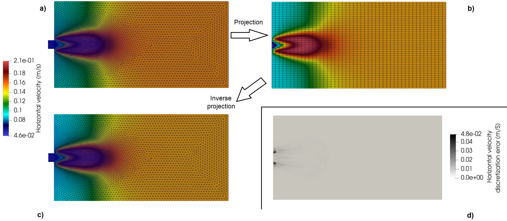

**********************
Pre/Post deep learning
**********************

Some deep learning workflow applied to physics contexts require the projection of fields defined on an unstructured mesh onto a rectilinear grid, and inversely.

   Example pf deep learning pre/post

The mesh and solution associated to a previously computed flow field is read (see also :numref:`_figPrePost_img1`, top-left image):

.. literalinclude:: PrePostDeepLearning.py
   :language: python
   :emphasize-lines: 12,15-18
   :linenos: