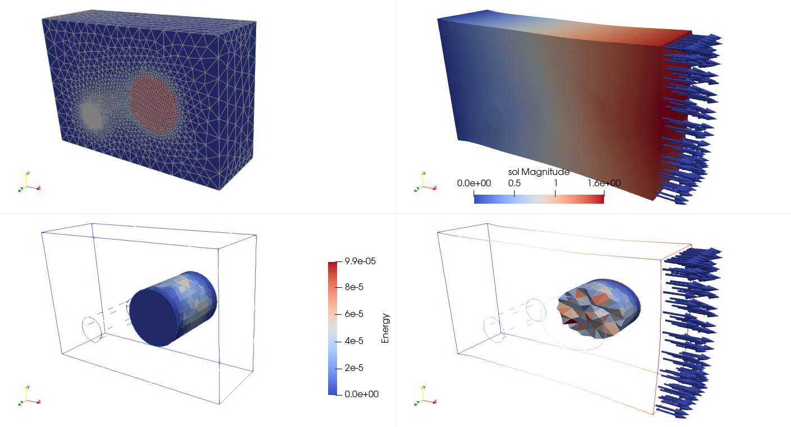

**********************************
Two inclusions mechanical analysis
**********************************

Here we present a study case of a thick plate with 2 inclusions. One softer and the other stiffer than the base material. We then compute the energy deformation on one inclusion.

   Example mechanical simulation and post processing

.. literalinclude:: TwoInclusions.py
   :language: python
   :emphasize-lines: 12,15-18
   :linenos: