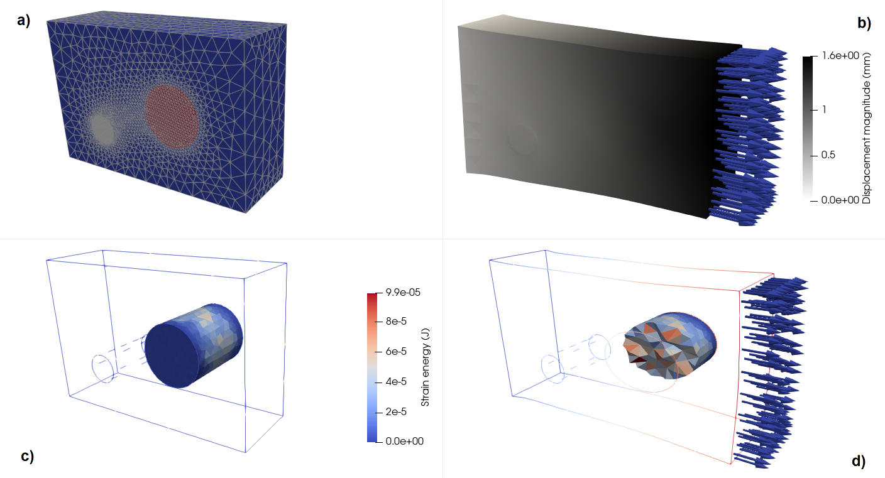

# Summary

Numerical simulations of physical phenomena can be computed by many (commercial/free) software packages, but despite the apparent variety, all of them rely on a relatively small set of operations during the preparation, exploitation and post-processing of these simulations, e.g. handling and modifying meshes and fields. BasicTools is a Python library designed to address these supporting tasks. It features an efficient data model for meshes and field objects, as well as input/output routines compatible with various formats. A finite element engine allows to assemble abstract variational formulations and integrate fields on volumes and surfaces.

BasicTools is actively used in artificial intelligence and model order reduction [@ROM-net; @mca26010017; @UQindustrialDesign; @datatargetVAE], topology optimization [@nardoni], and material sciences [@pymicro] projects.

# Statement of need

Industrial design tasks often rely on numerical simulation workflows involving different software packages, each providing its own specific post-processing tools. Common tasks like transferring computed fields from one tool to another must be routinely implemented, with subtle variations. This limits interoperability and increases complexity.

BasicTools is a solution to these concerns. It introduces a data model for meshes and related physical fields that can be populated using different readers and exported using various writers: No new mesh or solution format is forced upon the user. The data-oriented design of BasicTools allows high performance operations using a high-level language (Python with NumPy). BasicTools allows to convert meshes to other "in-memory" formats (VTK [@VTK4], PyVista [@sullivan2019pyvista], MeshIO [@meshio], CGNS [@cgns], Gmsh [@gmsh] ) enabling mixing (and reusing) the various treatments available in other frameworks.
Other features available in BasicTools include various mesh handling routines, field transfer operators and a flexible finite element engine.

# State of the field

In the computational fluid dynamics community, the CFD General Notation System (CGNS) [@cgns] format is a de-facto standard. However, to the authors' knowledge, no such standard exists for solid mechanics.
One may consider respectively VTK and MeshIO for mesh manipulation and file format conversion, but the post-processing of integration point data, a key requirement in solid mechanics, would not be possible. Most available tools implement the simple, but potentially dangerous, approach of extrapolating the integration point values to the nodes of the mesh or averaging in every cell. This can lead to a misinterpretation of the solution and incorrect engineering decisions.
Also, only a few finite element engines allow assembling abstract variational formulations on arbitrary geometries (e.g. FreeFem++ [@freefempp] and FEniCS [@fenics]).

# Overview

The main features of BasicTools are:

- Meshes (in module `Containers`):
  `ConstantRectilinearMesh` and `UnstructuredMesh` encapsulate respectively the data model for constant rectilinear and unstructured mesh types. Unstructured meshes are efficient: Elements are stored using only one array for each element type. Both mesh types can feature nodes and element tags. Many functions are available for creating, cleaning and modifying meshes (e.g. field projection and mesh morphing).
- Filters (in module `Containers`):
  Various types of `ElementFilter`s and `NodeFilter`s allow to handle subparts of meshes by selecting element- and node-sets using threshold functions, tags, element types, element dimensionality and masks. Filters can be combined using Boolean operations (union, complementary,...).
- A finite element engine (in module `FE`):
  A general weak formulation engine able to integrate fields over parts of the meshes is available. The `FETools` submodule contains specific functions for Lagrange P1 finite elements, including the computation of stiffness and mass matrices. The domain of integration is defined using `ElementFilter`s making the integration domain flexible. P0 and P2 Lagrange finite element spaces are implemented and tested. The framework is non-isoparametric: the user can write weak formulations mixing P0, P1 and P2 fields on P1 or P2 meshes.
- Input/Output functions (in module `IO`):
  Various readers (respectively, writers) for importing (respectively, exporting) meshes and solution fields from (respectively, to) BasicTools' internal data model are available. Supported formats include geo/geof (Z-set [@zset]), VTK, XDMF, SAMCEF, ABAQUS, and a bridge with MeshIO is provided. Readers for the ABAQUS and SAMCEF proprietary formats are also enabled when properly licensed software is available locally. See [BasicTools documentation](https://basictools.readthedocs.io/en/latest/_source/BasicTools.IO.html#submodules) for more details.
- Implicit geometry engine (in module `ImplicitGeometry`):
  Arbitrary subdomains can be defined using implicit geometries (level-set function). Basic shapes (spheres, half-spaces, cylinders, cubes), transformations (symmetry, translation, rotation) and binary operators (union, difference and intersection) can be used to construct complex shapes. These shapes can be used to select elements (using `ElementFilter`), or be evaluated on point clouds to explicitly construct iso-zero surfaces.
- Linear algebra functions (in module `Linalg`):
  Some common operations on linear systems for finite elements are implemented: penalization, elimination, Lagrange multipliers and the Ainsworth [@AINSWORTH20016323] method to impose essential boundary conditions or linear multi-point constraints. The submodule `LinearSolver` offers an abstraction layer for sparse linear solvers, including: Cholesky of the `sksparse` package; factorized, CG, lsqr, gmres, lgmres of the `scipy.sparse.linalg` module; CG, LU, BiCGSTAB, SPQR of the C++ Eigen library; and the AMG solver of `pyamg` package.

The large majority of functions are illustrated in the same file where they are defined, in `CheckIntegrity` functions.

# Examples

We present two examples, see [BasicTools documentation](https://basictools.readthedocs.io/en/latest/Examples.html) for complete details.

## Pre/post deep learning

Convolution-based deep learning algorithms generally rely on structured data. BasicTools is used to transfer a field computed on an unstructured mesh using finite elements to a structured grid and vice versa. To validate the operation, the error on the final field is evaluated with respect to the original field.

## Mechanical analysis: Thick plate with two inclusions

Consider a thick plate with two inclusions, one softer and the other stiffer than the base material. The plate is clamped on the left side with a negative pressure applied on the right side. We compute the strain energy on only one inclusion. The linear elasticity problem is solved using P1 Lagrange finite elements on an unstructured mesh.

# References
